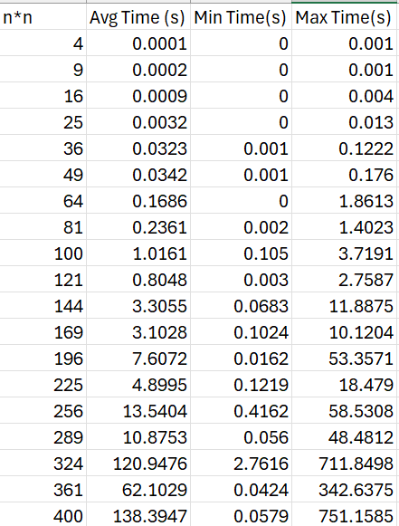
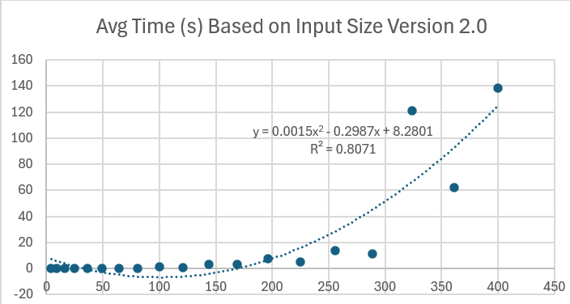
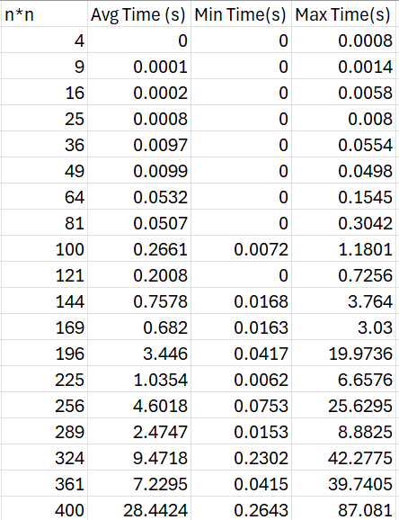
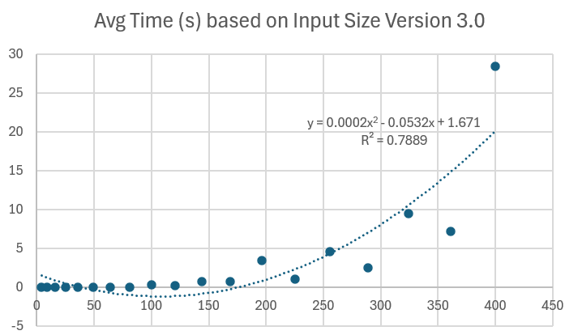
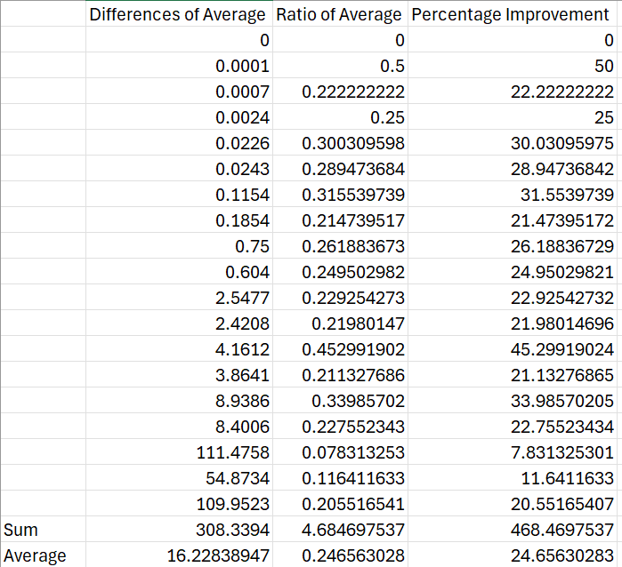
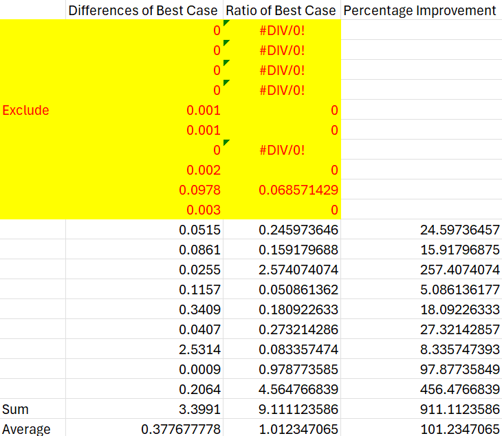
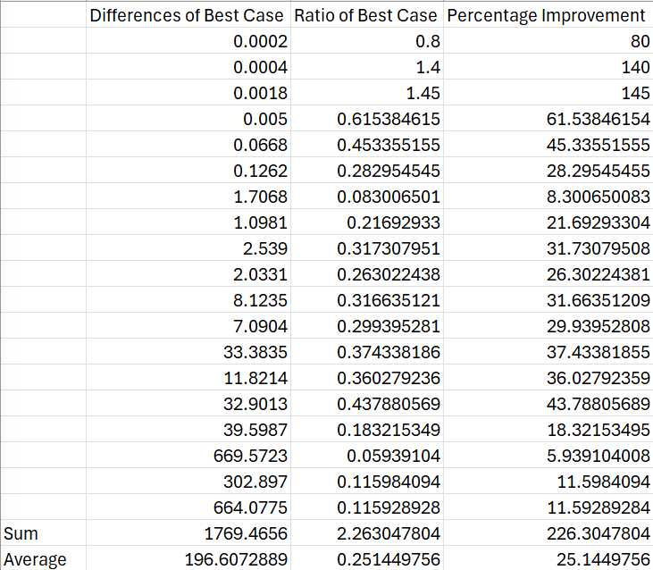

# Comparing Versions 2.0 and 3.0

Description: Compared the time taken (average, minimum and maximum) over 50 iterations per n for n in range of 2 to 20 of versions 2.0 and 3.0.

## Version 2.0
As shown below, version 2.0 has very similar speed to version 1.0, suggesting the slight tweaks did very little for us

## Version 3.0
As shown below, version 3.0's improvements from version 2.0 improve the speed of the system.

## Comparing the Averages
Analyzing the percentage improvement of the average time taken for each system from version 2.0 to version 3.0, we can see that version 3.0 performs, on average, 24.66% faster.

## Comparing the Best Case (Minimum Time Taken)
Analyzing the best case scenario for each size of matrix (the minimum time taken), and excluding values that are not constructive, we can see that, on average, version 3.0 is 101.2% faster (about double) than version 2.0.

## Comparing the Worst Case (Maximum Time Taken)
Analyzing the worst case scenario (maximum time taken), we can see that version 3.0 is on average 25.14% faster in the worst case than version 2.0.

## Conclusions
With this data, we can conclude a few things
1. Version 3.0 is faster on average, in worst case scenarios and best case scenarios. Clearly, the optimization of placing the number with the largest number of unique factors in the top left simply speeds finding the ideal ordering much faster.
2. Additional improvements such as placing other numbers with many unique factors in the corners could yield even better results. 
3. As a sidenote, comparing the best case scenarios is not very useful, as the best case scenario is often so fast for small systems that it can't time how quick it was. Excluding many of the values likely skews the results.