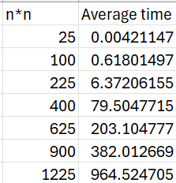
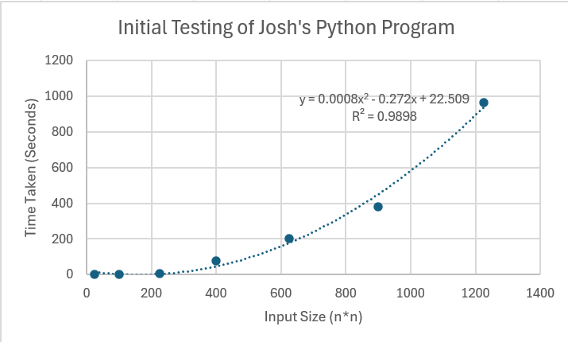
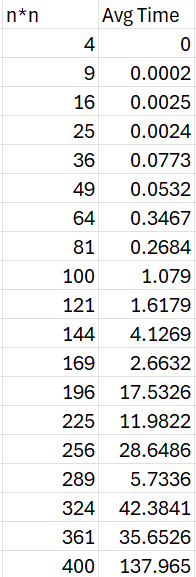
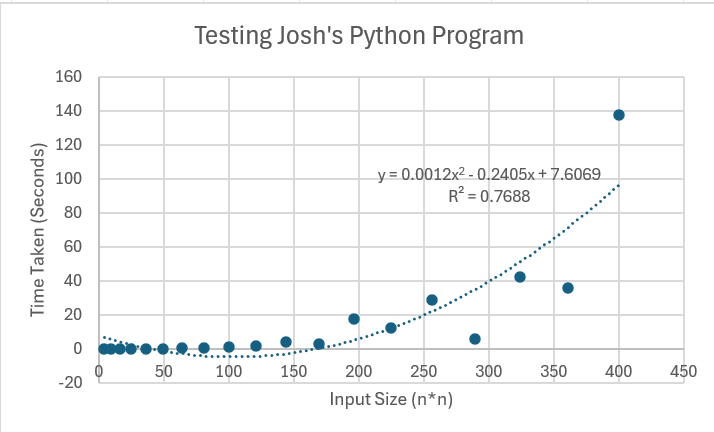
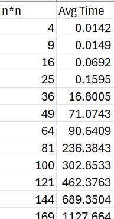
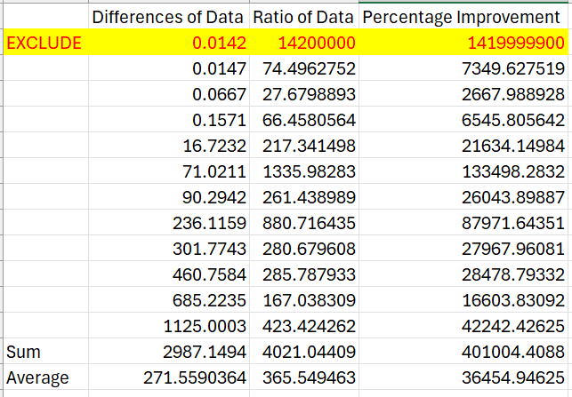

# Stress test of the Grid Prime Labeling Programs

## Testing the python version

### First test
Description: testing 20 times each for all nxn from 5 to 40 counting up by 5

Results:

### Second Test (more rigorous)
Description: Testing all n*n for n in range of 2 to 20. Testing each n\*n 10 times and finding the average

Results:

## Testing the C Version
Description: Testing all n*n for n in range of 2 to 20. Testing each n\*n 10 times and finding the average. 

Results:
- The program was only able to complete up to 13x13 in the timeframe

## Conclusions
1. We can observe that the python program yields results quicker in the range we tested, an average of 36454% faster, shown below

2. We can also observe that, in the range we tested, the entropy of John's C program is lesser than that of the Python program. This is shown in the $r^2$ value of the regression trendline being much closer to ideal on John's data.
3. Finally, we can observe the interesting fact that, due to randomness, the calculation of some higher-order graphs, e.g. the 17x17 matrix, the average time was much faster than even that of the 14x14. This is due to the random shuffling happening to be more favorable for the 17x17 matrices. Finding some way of scoring the orderings and immediately discarding orderings that have meet certain criteria could be beneficial in speeding up the generation.
4. More rigorous testing is in order; to truly get a good average, generating more systems for each n will be beneficial.